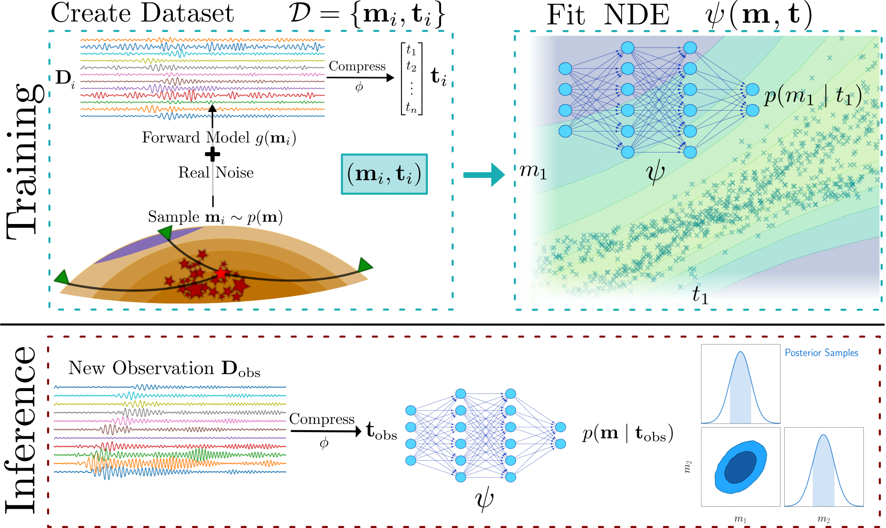

## Full-waveform seismic source inversion using simulation-based inference

This is the official repo used to produce the results in [Saoulis et al. (2024)](https://arxiv.org/abs/2410.23238).

## Table of Contents

- [About](#about)
- [Getting Started](#getting_started)
- [Usage](#usage)
- [Technical Details](#technical)

## About <a name = "about"></a>

Simulation-based inference (SBI) uses machine learning (ML) to build empirical models of key quantities in Bayesian inference. For example, SBI can train neural density estimators (NDEs) to build probabilistic models of the likelihood (which encodes a model of the data errors) or the posterior distribution explicitly. 

Seismic waveform data contains complicated noise that common Gaussian likelihood assumptions fail to adequately model. This package uses the [`sbi`](https://github.com/sbi-dev/sbi) library to build, train, and sample from NDEs, which then serve as empirical surrogates of the likelihood. 

Forward modelling is currently performed using [`Instaseis`](https://instaseis.net/), though `seismo-sbi` is designed to be forward model agnostic.

### `seismo-sbi` workflow

SBI builds a dataset of realistic observations, drawing samples from likelihood directly. It then trains a NDE to model the resulting likelihood (or posterior) distribution. Once trained, new observations can be fed through the NDE to perform inference, completely foregoing the forward model. 


_Fig. 3 from the `seismo-sbi` paper._

## Getting Started <a name = "getting_started"></a>

### Prerequisites

- Conda
- Python >=3.8

Install Anaconda or Miniconda. Set up your conda environment by executing the following command in the terminal, assuming `my_env` is the name of your conda environment:

```
conda create -n "my_env" python=3.8
conda activate my_env
```

### Installing

First, install `instaseis`, which is best installed through `conda-forge`:

```
conda install -y -c conda-forge instaseis
```

Installation of the library can then be done by navigating to the top-level directory `seismo-sbi` and running:
```
pip install -e .
```

## Usage <a name = "usage"></a>

An example notebook is provided under [examples/azores_inversion.ipynb](examples/azores_inversion.ipynb). This notebook uses SBI to perform a (i) fixed location MT inversion and (ii) full 10-parameter MT and time-location for the 13/01/2022 Azores event in [Saoulis et al. (2024)](https://arxiv.org/abs/2410.23238). For (i), a comparison between SBI and the Gaussian likelihood approach is provided as it is computationally cheap.

Before running the notebook, you will need to run the two provided scripts
```
cd scripts
python download.py
python generate_noise_database.py
```
which downloads the nearby IPMA permanent land station data, and then processes the data to build an event file and a noise catalogue. 

## Technical details <a name = "technical"></a>

This section is under construction.
