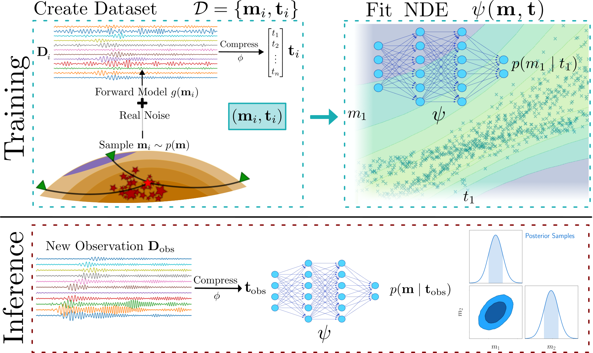

## Full-waveform seismic source inversion using simulation-based inference

Improving moment tensor solutions by accounting for non-Gaussian data and theory errors in full waveform data using machine learning. 

This is the official repo used to produce the results in [Saoulis et al. (2025)](https://doi.org/10.1093/gji/ggaf112) and Saoulis et al. 2026 (in prep.).


### NEW: Theory errors example

After installation (see below), try running the minimal example to perform SBI on the LV2 SoCal Long Valley Caldera event:

[examples/theory_errors_LV2.ipynb](examples/theory_errors_LV2.ipynb)

### Data errors paper

We are currently working on an updated, unified version of this repository. However, some example notebooks are not backware compatible yet. For the data errors paper [Saoulis et al. (2025)](https://doi.org/10.1093/gji/ggaf112), revert to the earlier release to ensure all examples work correctly:

https://github.com/asaoulis/seismo-sbi/releases/tag/paper-release

## Table of Contents

- [About](#about)
- [Getting Started](#getting_started)
- [Usage](#usage)
- [Data Preparation](#data)
- [Testing](#testing)
- [Technical Details](#technical)

## About <a name = "about"></a>

Simulation-based inference (SBI) uses machine learning (ML) to build empirical models of key quantities in Bayesian inference. For example, SBI can train neural density estimators (NDEs) to build probabilistic models of the likelihood (which encodes a model of the data errors) or the posterior distribution explicitly. 

Seismic waveform data contains complicated noise and theory errors that common Gaussian likelihood assumptions fail to adequately model. This package uses the [`sbi`](https://github.com/sbi-dev/sbi) library to build, train, and sample from NDEs, which then serve as empirical surrogates of the likelihood. 

Forward modelling is currently performed using [`Instaseis`](https://instaseis.net/) and Computer Programmes for Seismology, though `seismo-sbi` is designed to be forward model agnostic.

### `seismo-sbi` workflow

SBI builds a dataset of realistic observations, drawing samples from likelihood directly. It then trains a NDE to model the resulting likelihood (or posterior) distribution. Once trained, new observations can be fed through the NDE to perform inference, completely foregoing the forward model. 


_Fig. 3 from the `seismo-sbi` paper._

## Getting Started <a name = "getting_started"></a>

### Prerequisites

- Conda
- Python >=3.8

Install Anaconda or Miniconda. Set up your conda environment by executing the following command in the terminal, assuming `my_env` is the name of your conda environment:

```
conda create -n "my_env" python=3.8
conda activate my_env
```

### Installing

First, install `instaseis`, which is best installed through `conda-forge`:

```
conda install -y -c conda-forge instaseis
```

Installation of the library can then be done by navigating to the top-level directory `seismo-sbi` and running:
```
pip install -e .
```

## Usage <a name = "usage"></a>

An example notebook is provided under [examples/azores_inversion.ipynb](examples/azores_inversion.ipynb). This notebook uses SBI to perform a (i) fixed location MT inversion and (ii) full 10-parameter MT and time-location for the 13/01/2022 Azores event in [Saoulis et al. (2024)](https://arxiv.org/abs/2410.23238). For (i), a comparison between SBI and the Gaussian likelihood approach is provided as it is computationally cheap.

Before running the notebook, download the data and build the catalogues:
```bash
cd scripts
python custom_download.py --stations_file configs/indo_pacific/stations.txt \
    --output_dir /data/azores --starttime 2022-01-13T00:00:00 --endtime 2022-01-14T00:00:00
python build_catalogue.py --catalogue azores_events.xml \
    --data_dir /data/azores --stationxml_dir /data/azores/stationxml \
    --stations_file configs/indo_pacific/stations.txt \
    --output_dir /data/azores/catalogue --duration 200 --sampling_rate 1.0 \
    --noise_start 2022-01-13 --noise_end 2022-01-14
```
This downloads the nearby IPMA permanent land station data and builds event + noise h5 catalogues.

## Data Preparation <a name = "data"></a>

Preparing real seismic data for the SBI pipeline requires three steps: downloading raw waveforms and instrument responses, building event and noise h5 catalogues, and pointing the YAML config at the results.  All intermediate files are standard obspy formats (`.mseed` + StationXML); HDF5 is produced only at the final boundary step.

### 1. Download

Download BH? waveforms and StationXML for a time period long enough to include both your target events and a representative noise sample (weeks to months for a real study):

```bash
cd scripts
python custom_download.py \
    --stations_file configs/long_valley/stations.txt \
    --output_dir    /data/project \
    --starttime     2024-01-01T00:00:00 \
    --endtime       2024-02-01T00:00:00
```

Data are written to `{output_dir}/{station}/{year}.{jday}/` and StationXML to `{output_dir}/stationxml/`.

### 2. Build event + noise catalogues

`build_catalogue.py` does everything in one command: it pre-processes the raw data in daily chunks (response removal → filter → resample), then slices each event window and each clean noise window into an h5 file.  Pass either a QuakeML file or query FDSN directly:

```bash
# From a QuakeML catalogue file
python build_catalogue.py \
    --catalogue     events.xml \
    --data_dir      /data/project \
    --stationxml_dir /data/project/stationxml \
    --stations_file configs/long_valley/stations.txt \
    --output_dir    /data/catalogue \
    --duration      200 \
    --sampling_rate 1.0 \
    --noise_start   2024-01-01 \
    --noise_end     2024-02-01 \
    --n_jobs        8

# Or query FDSN for events automatically
python build_catalogue.py \
    --fdsn_query_center 35.7,-117.5 \
    --fdsn_min_magnitude 4.0 \
    --data_dir      /data/project \
    --stationxml_dir /data/project/stationxml \
    --stations_file configs/long_valley/stations.txt \
    --output_dir    /data/catalogue \
    --duration      200 --sampling_rate 1.0 \
    --noise_start   2024-01-01 --noise_end 2024-02-01 \
    --n_jobs        8
```

This produces:
```
/data/catalogue/events/{YYYYMMDDTHHMMSS}.h5   — one per target event
/data/catalogue/noise/{YYYY.MM.DD.HH.MM}.h5   — one per clean noise window
/data/catalogue/_daily/{station}/{YYYY.DDD}/  — cached daily processed mseed (reusable)
```

Each run is resumable: existing h5 and daily files are skipped automatically.

For a single event without a full noise catalogue, `custom_preprocess.py` is simpler:

```bash
python custom_preprocess.py \
    --data_dir      /data/project \
    --output_dir    /data/noise/long_valley \
    --event_name    LV2 \
    --event_starttime 1997-11-22T17:20:35 \
    --event_endtime   1997-11-22T17:23:54
```

### 3. Run the SBI inversion

Point `jobs.real_event_path` and `inference.noise_model_path` in your YAML config at the event and noise directories, then:

```bash
python event_inversion.py --config configs/long_valley/lv2.yaml
```

### HDF5 schema

Every h5 file produced by the pipeline has this layout, read directly by `RealNoiseSampler` and `SimulationDataLoader`:

```
/outputs/{station}/{Z,1,2}   — waveform arrays  (npts = compute_data_vector_length + 1)
/misc/{station}/{Z,1,2}      — autocorrelation from the pre-event noise window
```

Channel keys are always `Z`, `1`, `2` (never `E` or `N`).

## Testing <a name = "testing"></a>

The test suite lives in `tests/` and uses [pytest](https://docs.pytest.org/) with [pytest-cov](https://pytest-cov.readthedocs.io/) for coverage.

### Test markers

| Marker | Description | Default |
|---|---|---|
| `unit` | Fast, isolated, no file I/O | Always run |
| `integration` | Loads data stubs (HDF5 fixtures built in `tmp_path`) | Always run |
| `slow` | Full end-to-end synthetic inversions — require Instaseis DB or CPS binaries | Skipped |

### Running the tests

```bash
# Install test dependencies
pip install pytest pytest-cov

# Fast suite (unit + integration) — recommended after any edit
pytest tests/unit tests/integration -x -q

# Include slow end-to-end tests (need Instaseis DB or CPS installed)
pytest tests/ -x -q -m slow

# Full suite with coverage report
pytest tests/unit tests/integration \
    --cov=src/seismo_sbi \
    --cov-report=term-missing \
    --cov-report=html:htmlcov \
    -q
# then open htmlcov/index.html
```

### Slow test requirements

The `slow` end-to-end tests exercise the full stencil→compression→inference pipeline and require at least one forward model:

- **Instaseis**: set `INSTASEIS_DB` to the path of a precomputed Green's function database (e.g. `PREM_10s`), or place it at `/data/shared/ROSA_PREM_10s_disc`.
- **CPS** (Computer Programs in Seismology): install the CPS suite so that `hprep96`, `hspec96`, and `hpulse96` are on `PATH`, or set `CPS_PATH` to the directory containing these binaries.

### GitHub Actions

A minimal CI workflow runs the fast suite on every push.  Add `.github/workflows/tests.yml`:

```yaml
name: tests
on: [push, pull_request]
jobs:
  test:
    runs-on: ubuntu-latest
    steps:
      - uses: actions/checkout@v4
      - uses: conda-incubator/setup-miniconda@v3
        with:
          python-version: "3.8"
          channels: conda-forge,defaults
      - name: Install dependencies
        run: |
          conda install -y -c conda-forge instaseis
          pip install -e ".[test]"
      - name: Run fast tests
        run: pytest tests/unit tests/integration -x -q --cov=src/seismo_sbi --cov-report=xml
      - name: Upload coverage
        uses: codecov/codecov-action@v4
        with:
          files: coverage.xml
```

Add `[test]` extras to `pyproject.toml` if not already present:

```toml
[project.optional-dependencies]
test = ["pytest", "pytest-cov"]
```
