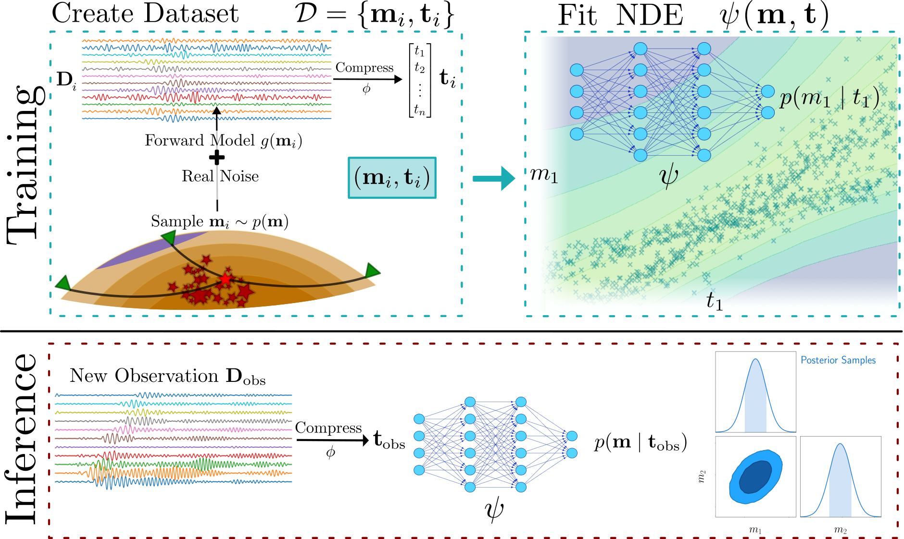

# seismo-sbi

[](https://asaoulis.github.io/seismo-sbi/)


Full-waveform seismic source inversion with simulation-based inference. Machine learning builds
an empirical model of the non-Gaussian data errors and theory errors in the waveforms, and the
moment-tensor solutions improve as a result.

Documentation: <https://asaoulis.github.io/seismo-sbi/>. The site has the API reference, the
configuration guide, the forward-model guide and the example notebooks rendered with their outputs.

`seismo-sbi` is a Python package for single-event moment-tensor inversion. One earthquake, its
stations and its forward model go in, and a posterior comes out. Each stage works on its own, or
the stages chain into one workflow:

- Forward models: Instaseis, Computer Programs in Seismology (CPS), Green's-function ensembles of
  perturbed 1-D Earth models, and a registry for a forward model of your own.
- Nuisance effects: what a real recording does to a synthetic seismogram (amplitude, time shift,
  dropout, scattering coda, anisotropy, dispersion). Each effect is applied at simulation time or
  at training time.
- Noise and likelihood: Gaussian-likelihood covariances (diagonal, Toeplitz, theory-block) with
  their estimator and samplers, and real-noise samplers built from recorded noise.
- Compression and inference: score compression, neural compressors, and neural posterior
  estimation (NPE) with [`sbi`](https://github.com/sbi-dev/sbi), plus Gaussian-likelihood MCMC for
  comparison.
- Data preparation and evaluation: download and preprocessing of real data with ObsPy, data
  quality checks, validation and calibration (TARP), and posterior plots.

## Installation

`seismo-sbi` needs Python 3.11, because the current conda-forge `instaseis` requires it.
`instaseis` is the most fragile dependency. Start from a fresh environment and install it first,
together with the rest of the scientific, seismology and geospatial stack, from conda-forge.
[`environment.yml`](https://github.com/asaoulis/seismo-sbi/blob/main/environment.yml) does this.
`pip` then installs the machine-learning and inference stack:

```
conda env create -f environment.yml      # python 3.11, instaseis, obspy, cartopy, basemap, ...
conda activate seismo-sbi
pip install -e ".[ml,plotting,notebooks]"   # torch, sbi, pytorch_lightning, ChainConsumer, jupyter, ...
```

`pip install -e .` alone installs the forward models, the noise covariances, the Gaussian
likelihood and the score compression (numpy, scipy, emcee, pyrocko). The `ml` extra adds the
neural compression and NPE training. The `plotting` extra adds the posterior figures. The
`notebooks` extra adds Jupyter for the examples.

A modern conda (23.10 or later) solves this environment in minutes with the `libmamba` solver. On
an older conda, run `conda install -n base conda-libmamba-solver` first, or append
`--solver libmamba`.

Some notebooks and tests also need:

- A local Instaseis database, named by the `INSTASEIS_DB` environment variable. A 10 s PREM
  database is enough. The Azores notebook falls back to streaming `syngine://prem_i_2s`.
- [Computer Programs in Seismology](https://www.eas.slu.edu/eqc/ComputerProgramsSeismology/index.html)
  (CPS), with `CPS_PATH` naming the directory that holds `hprep96`, `hspec96` and `hpulse96`.
- `git lfs pull`, for the LV2 compression checkpoint.

## Getting started

The notebooks under `examples/` are the quickest way in. They run headless, and the
[documentation site](https://asaoulis.github.io/seismo-sbi/) renders them with their outputs.
Work through them in this order:

1. [`ridgecrest_obspy`](https://github.com/asaoulis/seismo-sbi/blob/main/examples/ridgecrest_obspy.ipynb): the 2019
   Ridgecrest foreshock (Mw 6.4), from ObsPy objects to a moment tensor and back. FDSN gives the event, the
   stations and the waveforms. The `Stream` gives the observation and its noise covariance. Least squares gives
   the Gaussian-likelihood posterior, the synthetics come back as a `Stream` and the posterior as QuakeML. Runs
   offline from `examples/data/ridgecrest`. Needs an Instaseis database that resolves 20 s periods
   (`INSTASEIS_DB_20S`, such as `prem_a_20s`).
2. [`npe_flagship`](https://github.com/asaoulis/seismo-sbi/blob/main/examples/npe_flagship.ipynb): the same event
   with a neural posterior trained on 10,000 Instaseis simulations. The simulations carry the source depth and
   position, travel-time and amplitude errors, scattered coda and missing stations as nuisances. The neural
   posterior is compared with the Gaussian-likelihood posterior at the catalogue centroid: coverage on held-out
   simulations, posterior mass on the lune, the model on three stations, and a posterior predictive check.
   Needs `INSTASEIS_DB_20S` and a GPU for about 15 minutes. Its first cell installs the package on Google Colab.
3. [`nuisances`](https://github.com/asaoulis/seismo-sbi/blob/main/examples/nuisances.ipynb): the built-in
   nuisance effects at 20-50 s on the Ridgecrest stations, the simulation stage against the training stage, a
   user-defined per-station site transfer function, and two small networks trained with and without it.
   Needs `INSTASEIS_DB_20S` and a GPU for a few minutes.
4. [`custom_forward_model`](https://github.com/asaoulis/seismo-sbi/blob/main/examples/custom_forward_model.ipynb): a
   forward model of your own (a far-field P wave in a homogeneous whole space), registered with
   `register_simulator` and used in a Gaussian-likelihood inversion. Needs no database.
5. [`02_noise_covariances_and_likelihood`](https://github.com/asaoulis/seismo-sbi/blob/main/examples/02_noise_covariances_and_likelihood.ipynb): every
   Gaussian-likelihood covariance on synthetic noise, a theory-error covariance from an ensemble of
   Earth models, and the coverage of each score-compressed posterior on data from the reference Earth
   and from an Earth 1.5 % faster.
6. [`theory_errors_LV2`](https://github.com/asaoulis/seismo-sbi/blob/main/examples/theory_errors_LV2.ipynb): theory-error SBI on the LV2 Long Valley
   Caldera event, against the Gaussian likelihood. Needs CPS and the git-lfs checkpoint.
7. [`azores_inversion`](https://github.com/asaoulis/seismo-sbi/blob/main/examples/azores_inversion.ipynb): the 13/01/2022 Azores event of
   [Saoulis et al. (2024)](https://arxiv.org/abs/2410.23238), a fixed-location moment-tensor
   inversion with SBI and the Gaussian likelihood, then the full 10-parameter inversion of moment
   tensor, location and origin time.

The Azores notebook's first cell downloads and prepares its data:
```
cd scripts
python prepare_azores_example.py --output_dir ../examples/data/azores
```
The script downloads the IPMA/CIVISA `PM`-network land-station data from IPMA's FDSN node
(`http://ceida.ipma.pt`, the only open source for this network). It removes the instrument
response, filters and resamples, and writes the event waveform plus 300 noise windows under
`examples/data/azores/`. The windows that hold no earthquake are kept in `noise_screened/`.

## How it works

Simulation-based inference (SBI) uses machine learning to build empirical models of the
quantities Bayesian inference needs. A neural density estimator (NDE) is a neural network that
learns a probability distribution from samples of it. An NDE can learn the likelihood (the model
of the data errors) or the posterior itself.

Seismic waveforms carry complicated noise and theory errors (the difference between the forward
model's synthetics and the Earth's) that a Gaussian likelihood does not describe well. This package
uses the [`sbi`](https://github.com/sbi-dev/sbi) library to build, train and sample NDEs, which
then stand in for the likelihood.

SBI first builds a training set of realistic observations by drawing from the likelihood directly.
It simulates sources and adds the noise and the theory error that the recordings carry. It then
trains an NDE on that set to model the likelihood, or the posterior. Once trained, the NDE gives
the posterior of a new observation without any further call to the forward model.


_Fig. 3 from the `seismo-sbi` paper._

The forward models are [`Instaseis`](https://instaseis.net/) and Computer Programs in Seismology
(CPS). `seismo-sbi` does not depend on either: every forward model lives in `seismo_sbi.simulators`,
and [docs/simulators.md](docs/simulators.md) maps the package and shows how to plug in your own.
[docs/pipeline.md](docs/pipeline.md) describes a full inversion: the SBI pipeline, score
compression and the Gaussian-likelihood inversion. [docs/training.md](docs/training.md) covers the
training of neural compressors and amortised NPE models.

## Library map

Import each name from the module that defines it.

| package | what it holds |
|---|---|
| `simulators` | forward models: sources, receivers, the `Simulator` interface and its registry, Green's-function ensembles. The backends are in `instaseis/`, `cps/` and `axisem/` (the perturbed 1-D Earth models an Instaseis ensemble is built from). See [docs/simulators.md](docs/simulators.md) |
| `nuisance_effects` | what a real recording does to a synthetic seismogram: amplitude, time-shift, dropout, scattering coda, anisotropy and dispersion effects, and the `PostProcessingChain` that applies them at simulation or training time |
| `sbi` | the inference pipeline (`pipeline`, `configuration`, `training_configuration`), scalers and job runners |
| `sbi.noises` | noise models: the Gaussian-likelihood covariances (diagonal, Toeplitz, theory-block), their estimator and samplers, and real-noise samplers for training |
| `sbi.compression` | compression to one summary per parameter: derivative stencils and score compressors |
| `sbi.npe` | neural posterior estimation on raw waveforms: the embedding net (`networks/`), the flow, the training data and loaders (`data/`), the trainer (`training/`) and posterior sampling for station subsets |
| `sbi.inversion` | inversion of compressed data: Gaussian-likelihood sampling, neural posterior estimation and iterative least-squares source estimates |
| `sbi.datasets` | training sets: prior draws simulated in parallel, their noisy compressed versions, and the data an NPE training run consumes |
| `sbi.types` | typed records passed between pipeline stages |
| `data_handling` | observed data ahead of inference. `preprocessing/` finds raw data, removes the response, filters, resamples, windows and writes the HDF5 the pipeline reads |
| `data_quality` | comparison of a reference synthetic with observed waveforms: per-trace metrics and the quality policy built on them |
| `priors` | catalogue-driven statistical priors for dataset generation |
| `evaluation` | pipeline build for evaluation, held-out validation and posterior metrics |
| `moment_tensor` | moment-tensor conventions, scalar moments, decompositions, pyrocko tensors, Kagan angles and lune angles |
| `plotting` | figures for simulations, posteriors and evaluation runs |
| `utils` | shared helpers: parallel execution, error handling, environment set-up, trace helpers |

The YAML configuration that drives every pipeline is described in
[docs/configuration.md](docs/configuration.md).

## Command-line scripts

The tracked scripts under `scripts/` are launchers. Each parses a few flags, builds the
configuration and calls one library entry point. Run any of them with `--help` to list every flag.

| script | what it does | main flags |
|---|---|---|
| `train_NPE.py` | generates the training set and trains an NPE compressor and flow | `--config`, `--run-name`, `--stage {generate,meta,train}`, `--epochs`, `--devices`, `--architecture`, `--train-batch-size`, `--num-simulations` |
| `event_inversion.py` | runs a complete pipeline (Gaussian likelihood, SBI, or both) on the synthetic and real events of a configuration | `--config` |
| `custom_download.py` | downloads waveforms and StationXML from FDSN providers | `--stations_file`, `--output_dir`, `--providers`, `--starttime`, `--endtime` |
| `build_catalogue.py` | builds event and noise HDF5 catalogues from downloaded data | see step 2 below |
| `prepare_event.py` | prepares one event and its pre-event noise from a `preprocessing:` configuration block | `--config`, `--event-name` |
| `prepare_azores_example.py` | downloads and prepares the data of the Azores example notebook | `--output_dir`, `--force` |
| `build_axisem_ensemble.py` | stages an AxiSEM ensemble of perturbed 1-D Earth models from one configuration | `--config`, `--dry-run`, `--from-bm-dir`, `--name` |

## Preparing real data

Real seismic data reach the SBI pipeline in three steps: download the raw waveforms and instrument
responses, build the event and noise HDF5 catalogues, and point the YAML configuration at the
results. Every intermediate file is a standard ObsPy format (`.mseed` and StationXML). HDF5 is
written only at the final step. To work from ObsPy objects in memory instead (a `Stream`, an
`Inventory`, an `Origin`) and get the posterior back as a QuakeML `Event`, see
[docs/obspy.md](docs/obspy.md).

### 1. Download

Download `BH?` waveforms and StationXML for a period long enough to hold your target events and a
representative sample of noise (weeks to months for a real study):

```bash
cd scripts
python custom_download.py \
    --stations_file configs/long_valley/stations.txt \
    --output_dir    /data/project \
    --starttime     2024-01-01T00:00:00 \
    --endtime       2024-02-01T00:00:00
```

The waveforms are written to `{output_dir}/{station}/{year}.{jday}/` and the StationXML to
`{output_dir}/stationxml/`.

### 2. Build the event and noise catalogues

`build_catalogue.py` does the rest in one command. It preprocesses the raw data in daily chunks
(response removal, filter, resample), then slices each event window and each clean noise window
into an HDF5 file. Give it a QuakeML file, or let it query FDSN for the events:

```bash
# From a QuakeML catalogue file
python build_catalogue.py \
    --catalogue     events.xml \
    --data_dir      /data/project \
    --stationxml_dir /data/project/stationxml \
    --stations_file configs/long_valley/stations.txt \
    --output_dir    /data/catalogue \
    --duration      200 \
    --sampling_rate 1.0 \
    --noise_start   2024-01-01 \
    --noise_end     2024-02-01 \
    --n_jobs        8

# Or query FDSN for events automatically
python build_catalogue.py \
    --fdsn_query_center 35.7,-117.5 \
    --fdsn_min_magnitude 4.0 \
    --data_dir      /data/project \
    --stationxml_dir /data/project/stationxml \
    --stations_file configs/long_valley/stations.txt \
    --output_dir    /data/catalogue \
    --duration      200 --sampling_rate 1.0 \
    --noise_start   2024-01-01 --noise_end 2024-02-01 \
    --n_jobs        8
```

The output is:
```
/data/catalogue/events/{YYYYMMDDTHHMMSS}.h5   one per target event
/data/catalogue/noise/{YYYY.MM.DD.HH.MM}.h5   one per clean noise window
/data/catalogue/_daily/{station}/{YYYY.DDD}/  cached daily processed mseed (reusable)
```

A run is resumable: existing HDF5 and daily files are skipped.

For a single event without a full noise catalogue, `prepare_event.py` is simpler. Its
`preprocessing:` block names the raw data, the station file, the event window, the band and the
output. `examples/configs/LV2_preprocessing.yaml` is the Long Valley event:

```bash
python prepare_event.py --config ../examples/configs/LV2_preprocessing.yaml
```

From Python, `prepare_event(PreprocessingConfiguration.from_yaml(path))` in
`seismo_sbi.data_handling.preprocessing.prepare_event` does the same.

### 3. Run the SBI inversion

In the YAML configuration:

- List each event file under `jobs.real_events`, as a name mapped to an HDF5 path.
- To train on the recorded noise, set `inference.sbi.noise_model` to `type: 'real_noise'` with
  `noise_catalogue_path` naming the noise directory.
- To test the synthetic events against the same noise, also add `real_noise: <noise directory>`
  under `jobs.noise_models`.
- Set `seismic_context.processing.filter_sampling_rate` to the raw rate the recordings were
  filtered at, so that the synthetics are filtered at the same rate. The key is required. See
  [docs/configuration.md](docs/configuration.md).

Then:

```bash
python event_inversion.py --config configs/long_valley/LV2_real.yaml
```

### HDF5 schema

Every HDF5 file the pipeline produces has this layout. `RealNoiseSampler` and
`SimulationDataLoader` read it directly:

```
/outputs/{station}/{Z,1,2}   waveform arrays (npts = compute_data_vector_length + 1)
/misc/{station}/{Z,1,2}      autocorrelation from the pre-event noise window
```

The channel keys are always `Z`, `1`, `2`, never `E` or `N`.

## Testing

The tests live in `tests/` and run with [pytest](https://docs.pytest.org/).
[pytest-cov](https://pytest-cov.readthedocs.io/) measures coverage.

| Marker | Description | Default |
|---|---|---|
| `unit` | Fast and isolated, no file I/O | Always run |
| `integration` | Loads data stubs (HDF5 fixtures built in `tmp_path`) | Always run |
| `slow` | Full end-to-end synthetic inversions. They need an Instaseis database or the CPS binaries | Skipped |

```bash
# Install test dependencies
pip install pytest pytest-cov

# Fast suite (unit + integration), recommended after any edit
pytest tests/unit tests/integration -x -q

# Include slow end-to-end tests (need Instaseis DB or CPS installed)
pytest tests/ -x -q -m slow

# Full suite with coverage report
pytest tests/unit tests/integration \
    --cov=src/seismo_sbi \
    --cov-report=term-missing \
    --cov-report=html:htmlcov \
    -q
# then open htmlcov/index.html
```

The `slow` end-to-end tests run the full pipeline, from the derivative stencil through
compression to inference, and need at least one forward model:

- Instaseis: set `INSTASEIS_DB` to the path of a precomputed Green's-function database (for
  example `PREM_10s`), or place the database at `/data/shared/ROSA_PREM_10s_disc`.
- CPS: install the suite so that `hprep96`, `hspec96` and `hpulse96` are on `PATH`, or set
  `CPS_PATH` to the directory that holds them.

The `[test]` extras (`pytest`, `pytest-cov`) are declared in `pyproject.toml`. The workflow
`.github/workflows/docs.yml` builds and publishes the documentation site on every push to `main`.
No workflow runs the test suite yet.

## Papers and citation

This package produced the results in [Saoulis et al. (2025)](https://doi.org/10.1093/gji/ggaf112)
and Saoulis et al. 2026 (in prep.). If you use it, please cite the relevant paper.

The data-errors example, [`azores_inversion`](https://github.com/asaoulis/seismo-sbi/blob/main/examples/azores_inversion.ipynb)
([Saoulis et al. (2025)](https://doi.org/10.1093/gji/ggaf112)), runs on the current release: data
download, processing and inversion. To reproduce the paper's full set of results exactly, use the
earlier release:

https://github.com/asaoulis/seismo-sbi/releases/tag/paper-release
